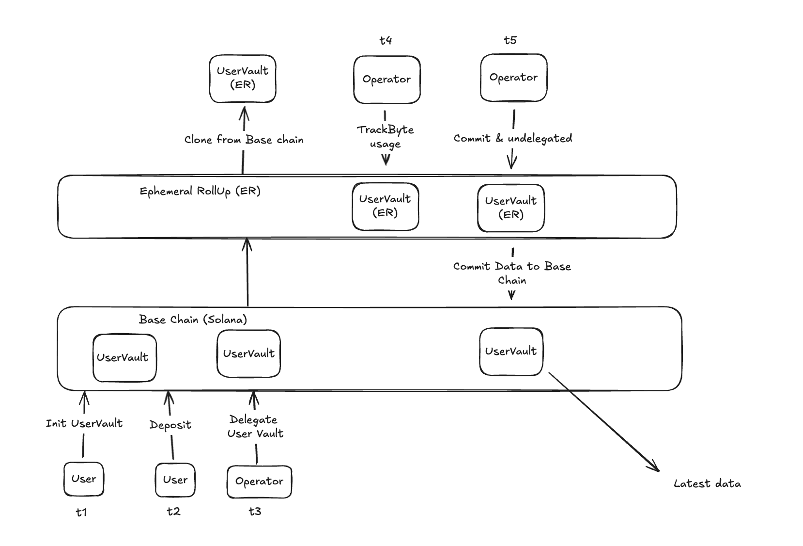

# ⚡ MagicBlock Usage-Based Billing (Solana + ER)

A sample smart contract that demonstrates a **fully on-chain usage-based billing system** using [MagicBlock Ephemeral Rollups (ER)](https://magicblock.xyz).

This example shows how you can rethink traditional backend infrastructure by tracking usage in **real-time** with ER and committing only when needed to the **base Solana chain**.

---

## 🧩 System Design Overview

This contract introduces two key components:

### 🔐 UserVault (per user)
- Lives both on the **Base Chain** and in the **Ephemeral Rollup (ER)**
- Tracks `bytes_used` by the user in real time
- Delegated to an operator who monitors usage
- When usage crosses a threshold, triggers a commit

### 🏦 SystemVault (central operator pool)
- Holds funds to cover billing costs
- Used by the operator to perform billing commits
- Can be charged via committed events from the ER

---

### 🖼️ Architecture Diagram



This flow is split across two layers:

#### ✅ Base Chain (Solana)
- `t1–t3`: User initializes and deposits to `UserVault`
- `t3`: Operator is delegated billing authority

#### ⚡ Ephemeral Rollup (ER)
- `t4`: Operator tracks real-time usage
- `t5`: Once threshold is hit, operator **commits** the billing update to base chain and **undelegates**

> ✅ Final state is stored on base chain. ER acts as a **live meter**, not a permanent ledger.

---

## ✅ Benefits of This Pattern

- 🔁 **Event-driven commit model**: no cron jobs or polling
- 🔒 **Fully on-chain**: no backend tracking servers
- ⚡ **Low latency**: ER gives you sub-10ms response time
- 🔍 **Auditable**: usage data is eventually committed to Solana base chain

---

## 🧪 Testing with Local ER Validator

### 1. Install Ephemeral Validator

```bash
npm install -g @magicblock-labs/ephemeral-validator
```

### 2. Start Local Validator

```bash
ACCOUNTS_REMOTE=https://rpc.magicblock.app/devnet
ACCOUNTS_LIFECYCLE=ephemeral ephemeral-validator
```

### 3. Run Tests Against Local Validator

```bash
PROVIDER_ENDPOINT=http://localhost:8899 WS_ENDPOINT=ws://localhost:8900 anchor test --skip-build --skip-deploy --skip-local-validator
```

---

## 🚀 Deployment Steps

### 1. Security Prerequisites

- Secure wallet private key storage
- Set upgrade authority carefully
- Clean up temporary keypairs
- Configure transaction fee limits if needed

### 2. Configure Solana CLI

```bash
solana config set -u {rpc_url} -k {wallet_key}.json
```

### 3. Build

```bash
anchor build
```

### 4. Deploy

```bash
solana program deploy target/deploy/simple_billing_magicblock.so
```

---

## 📄 License

MIT — open for contributions and forks.

---

## 💬 Contact

For questions, DM [@minhbear_sol](https://x.com/minhbear_sol)
